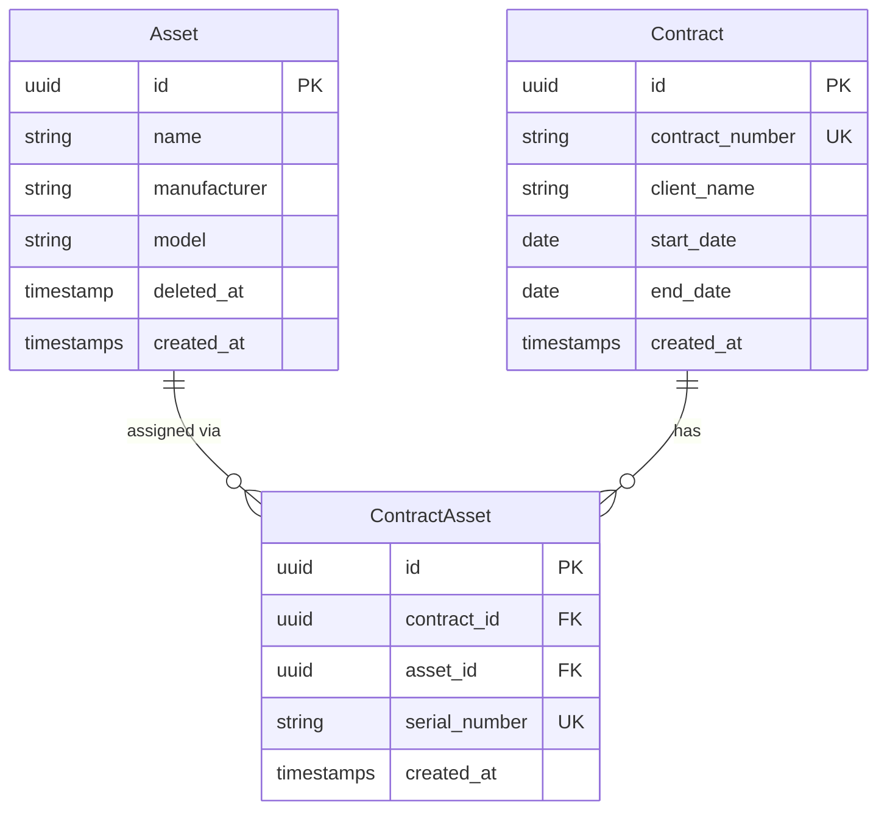
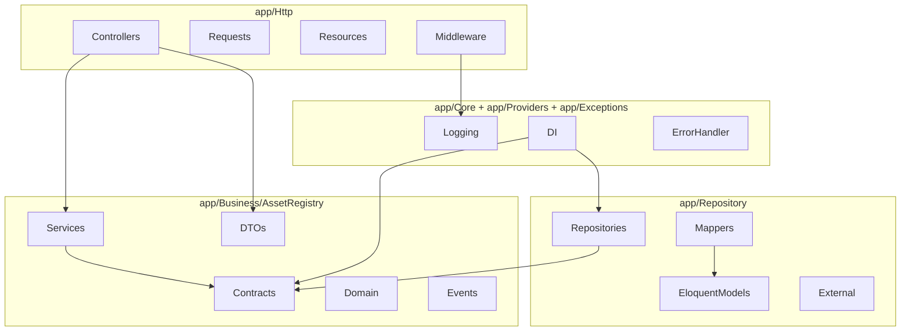

# Asset Register API — Implementation Plan

## Domain Model



## API Surface

```
GET    /api/v1/assets
GET    /api/v1/assets/{id}
POST   /api/v1/assets
PUT    /api/v1/assets/{id}
DELETE /api/v1/assets/{id}           (soft delete)

GET    /api/v1/contracts             (no assets embedded)
GET    /api/v1/contracts/{id}        (assets embedded)
POST   /api/v1/contracts
PUT    /api/v1/contracts/{id}
DELETE /api/v1/contracts/{id}        (hard delete, cascades contract_assets)

POST   /api/v1/contracts/{id}/assets        body: { asset_id, serial_number }
DELETE /api/v1/contracts/{id}/assets/{assetId}

GET    /api/docs                     (Swagger UI, Basic Auth)
```

## Layer Architecture



## Folder Structure

```
app/
  Business/AssetRegistry/
    Domain/
      Entities/         Asset.php, Contract.php, ContractAsset.php
      Aggregates/       ContractAggregate.php
      Exceptions/       AssetNotFoundException.php, ContractNotFoundException.php,
                        AssetAlreadyAssignedException.php, SerialNumberTakenException.php,
                        AssetHasActiveAssignmentsException.php
    Contracts/
      IAssetRepository.php
      IContractRepository.php
    Services/
      AssetService.php
      ContractService.php
    DTOs/
      AssetData.php, CreateAssetData.php, UpdateAssetData.php
      ContractData.php, CreateContractData.php, UpdateContractData.php
      ContractDetailData.php
      AssignAssetData.php
    Events/             AssetAssigned.php, AssetUnassigned.php

  Repository/Eloquent/
    Models/             AssetModel.php, ContractModel.php, ContractAssetModel.php
    Repositories/       EloquentAssetRepository.php, EloquentContractRepository.php
    Mappers/            AssetMapper.php, ContractMapper.php, ContractAssetMapper.php

  Http/
    Controllers/        AssetController.php, ContractController.php
    Requests/           CreateAssetRequest.php, UpdateAssetRequest.php,
                        CreateContractRequest.php, UpdateContractRequest.php,
                        AssignAssetRequest.php
    Resources/          AssetResource.php, ContractResource.php, ContractDetailResource.php
    Middleware/         LogApiRequest.php, SwaggerBasicAuth.php

  Providers/            AppServiceProvider.php (DI bindings)
  Exceptions/           Handler.php

  Core/
    Logging/            ApiLog.php (Eloquent model), RequestResponseLogger.php

tests/
  Unit/Business/        AssetServiceTest.php, ContractServiceTest.php,
                        ContractAggregateTest.php
  Feature/Api/          AssetApiTest.php, ContractApiTest.php,
                        ContractAssetApiTest.php, SwaggerAuthTest.php
  Integration/Repository/ EloquentAssetRepositoryTest.php, EloquentContractRepositoryTest.php
```

## Implementation Steps

### Step 0 — Dev bootstrap container
Since the host has no PHP, all PHP/Composer commands run inside a disposable container:
```powershell
docker run --rm -v "c:/Users/andob/lilla/asset-register:/app" -w /app php:8.5-cli <command>
```
Install Composer into the image on first use. This container is only for project scaffolding and dependency management — it is replaced by the proper `app` service once docker-compose is in place.

### Step 1 — Project bootstrap
- `composer create-project laravel/laravel` for Laravel 13
- Update `composer.json` PSR-4 to map `App\Business\`, `App\Repository\`, `App\Http\`, `App\Core\`
- Install packages: `zircote/swagger-php`, `darkaonline/l5-swagger` (Swagger UI), `laravel/pint` (code style)

### Step 2 — Migrations
- `create_assets_table`: `id` (uuid PK), `name`, `manufacturer`, `model`, `deleted_at`, timestamps
- `create_contracts_table`: `id` (uuid PK), `contract_number` (unique), `client_name`, `start_date`, `end_date` (nullable), timestamps
- `create_contract_assets_table`: `id` (uuid PK), `contract_id` (FK→contracts cascade delete), `asset_id` (FK→assets restrict delete), `serial_number` (unique), timestamps
- `create_api_logs_table`: `id`, `method`, `path`, `request_headers` (JSON), `request_body` (JSON), `response_status`, `response_body` (JSON), `duration_ms`, `created_at`

### Step 3 — Unit tests (red)
Write failing tests that define the expected behaviour of the Business layer — no implementation yet:
- `ContractAggregateTest`: assignAsset happy path, duplicate assignment throws, serial number collision throws
- `AssetServiceTest`: create, update, softDelete (rejects if active assignments exist), get, list — mock `IAssetRepository`
- `ContractServiceTest`: create, update, delete, get with assets, list, assignAsset, removeAsset — mock `IContractRepository`

### Step 4 — Business layer (green)
Implement until all unit tests pass:
- Domain entities as plain PHP classes: `Asset`, `Contract`, `ContractAsset`
- `ContractAggregate`: `assignAsset()` / `removeAsset()` with business rule enforcement
- Exception classes with `public readonly string $errorCode`
- Repository interfaces: `IAssetRepository`, `IContractRepository`
- DTO `readonly` classes: `AssetData`, `CreateAssetData`, `UpdateAssetData`, `ContractData`, `CreateContractData`, `UpdateContractData`, `ContractDetailData`, `AssignAssetData`
- `AssetService`, `ContractService`

### Step 5 — Integration tests (red)
Write failing tests for the Repository layer against a test database — no implementation yet:
- `EloquentAssetRepositoryTest`: find, list, save, soft delete, restrict delete when assignments exist
- `EloquentContractRepositoryTest`: find with assets, list without assets, save, delete cascades contract_assets

### Step 6 — Repository layer (green)
Implement until all integration tests pass:
- Eloquent models with `HasUuids`, soft deletes on `AssetModel`, relations
- Mappers: `AssetMapper`, `ContractMapper`, `ContractAssetMapper` — Eloquent ↔ domain entity, nothing crosses the boundary
- `EloquentAssetRepository`, `EloquentContractRepository` implementing the Business contracts

### Step 7 — Core infrastructure
- `RequestResponseLogger`: masks `Authorization`, `password`, `token`, `secret`; persists directly to `api_logs` table
- `LogApiRequest` middleware: stashes `hrtime(true)` on request in `handle()`, then in `terminate()` calculates `duration_ms` and calls `RequestResponseLogger` — runs after response is flushed, so client never waits; swallows own exceptions and falls back to Laravel log channel
- No queue, no extra service — single direct `INSERT` into `api_logs` (~1–3ms); queue can be added later if load justifies it
- `Handler.php`: maps domain exceptions to HTTP codes and the standard error envelope

### Step 8 — Feature tests (red)
Write failing HTTP-level tests — no controllers yet:
- `AssetApiTest`: full CRUD happy paths + error cases (404, 422, 409)
- `ContractApiTest`: full CRUD + contract detail with embedded assets
- `ContractAssetApiTest`: assign, remove, duplicate-assign error, serial number collision error
- `SwaggerAuthTest`: docs endpoint rejects missing/wrong credentials, accepts correct ones

### Step 9 — HTTP layer (green)
Implement until all feature tests pass:
- `AppServiceProvider`: bind `IAssetRepository` → `EloquentAssetRepository`, `IContractRepository` → `EloquentContractRepository`
- `routes/api.php` with `v1` prefix group
- `FormRequest` subclasses with validation rules + `#[OA\...]` annotations
- Thin controllers: resolve DTO from request → call service → return resource
- `AssetResource`, `ContractResource`, `ContractDetailResource` (embeds `AssetResource` collection)
- `SwaggerBasicAuth` middleware (reads `SWAGGER_USER` / `SWAGGER_PASSWORD` from `.env`)

### Step 10 — Swagger
- Configure `l5-swagger` to scan `app/Http/Controllers/` and `app/Http/Resources/`
- `#[OA\Info]` block in a dedicated `SwaggerSpec.php`
- Register `/api/docs` route (Swagger UI) behind `SwaggerBasicAuth`
- Add `php artisan l5-swagger:generate` to CI/CD step

### Step 11 — Docker
- `Dockerfile` multi-stage: builder (`composer install --no-dev`) + slim runtime (PHP 8.5-fpm)
- `docker-compose.yml`: `app` (PHP-FPM), `webserver` (Nginx), `db` (MySQL 8 with health check) — no Redis needed
- `docker-compose.override.yml`: Xdebug, bind-mount `./:/var/www`
- `nginx/default.conf`: serve `public/`, proxy PHP to `app:9000`

### Step 12 — PlantUML documentation

```
docs/
  architecture.puml
  domain-model.puml
  sequences/
    create-asset.puml
    update-asset.puml
    delete-asset.puml
    get-contract-detail.puml
    assign-asset.puml
    remove-asset.puml
```

**`architecture.puml`** — component/package diagram covering:
- Four named packages: `Http`, `Business/AssetRegistry`, `Repository`, `Core+Providers+Exceptions`
- Contents of each package listed as components
- Dependency arrows between packages matching the dependency rules table in `agents.mdc` (e.g. `Http` → `Business`, `Repository` → `Business\Contracts`, no arrow from `Business` to anything outside itself)

**`domain-model.puml`** — class diagram covering:
- `Asset`, `Contract`, `ContractAsset` domain entities with fields and visibility
- `SerialNumber`, `ContractNumber` value objects
- `ContractAggregate` with `assignAsset()` / `removeAsset()` method signatures
- `IAssetRepository`, `IContractRepository` interfaces with method signatures
- `AssetService`, `ContractService` with method signatures
- Dependency and implementation arrows between all classes

**`docs/sequences/*.puml`** — each file traces one full vertical slice:

Participants in every diagram: `Client`, `Controller`, `FormRequest`, `Service`, `IRepository`, `Mapper`, `EloquentModel`, `DB`

Each diagram includes:
- Happy path: request → validation → service → repository → mapper → DB → response
- `alt` block for the primary error path (e.g. not found, serial number conflict, active assignments guard)

## Key Business Rules Encoded in Domain
- Soft-deleted assets cannot be assigned to new contracts
- An asset cannot be added to a contract it is already on
- `serial_number` is globally unique across all `contract_assets` rows
- Deleting an `Asset` that has active `contract_assets` rows is rejected (`AssetHasActiveAssignmentsException`)
- Deleting a `Contract` cascades to its `contract_assets` but leaves `assets` intact
- Serial number on an existing assignment cannot be updated — remove + re-add only
